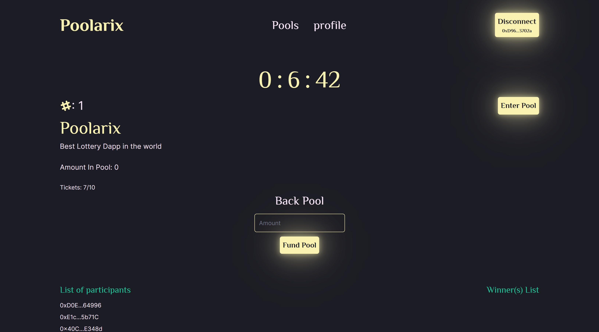
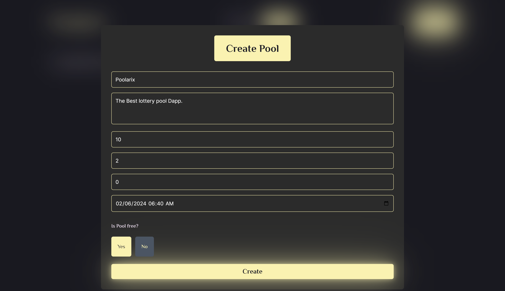

# Poolarix

Poolarix is a lottery pool decentralized application that utilizes API3 quantun random number generator to choose winners from a pool of participants which is done onchain fostering for a open and fair use of the application.

Onboarding users is easy with Poolarix, leveraging LightLink's Enterprise mode you don't need to bother about gas fees .
Still in the test phase, wer're trying out different features that will be implemented in the future, you can follow the checklist below to see our progress and keep track of upcoming features.

- Live demo: [Poolarix](https://poolarix.vercel.app/)
- Link to deployed smart contract: [smart contract](https://pegasus.lightlink.io/address/0xc29c64bb7Ea3D5F9190a46f06CAC8f236fc4399F)

## Snapshots

## Features

- [x] Create Pool
- [x] Fund Pool
- [x] Enter Pools for free (If pool allows for free entery)
- [x] Claim Prizes (Not Yet Fully functional)

## Major Features

- [x] Generate Winners randomly using API3 quantum random number Generation.
- [x] Free Gas (Possible by utilizing Light link's enterprise mode)
- [x] Used BlockScout Explorer to track deployed contarct address and verify the smart contract.

## Future Features
- [ ] Buy tickets to enter a pool
- [ ] Get lottery boxes as you interact.
- [ ] Ability to own and use lottery boxes in the future

## Tech Stack
This is a `Next.js`, `typescript`, `tailwind`, `thirdweb` project.

